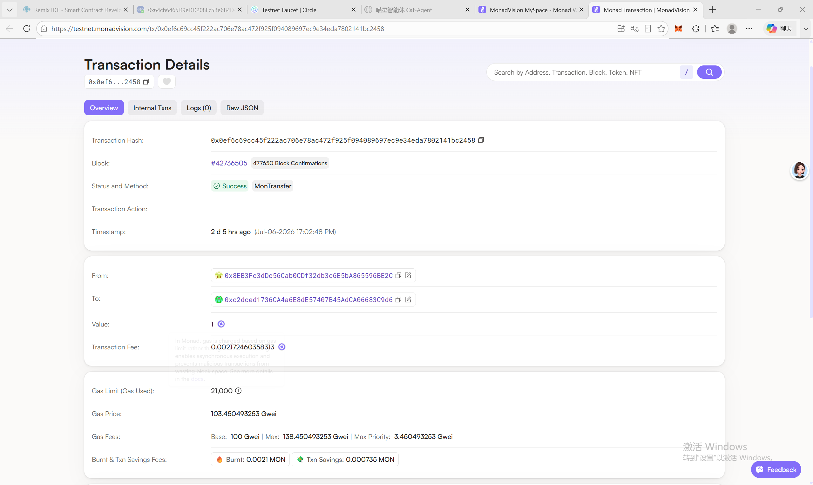

# Week 1 — 第一笔 Monad Testnet 链上交易

## 1. Transaction Hash

```
0x0ef6c69cc45f222ac706e78ac472f925f094089697ec9e34eda7802141bc2458
```

## 2. 区块浏览器链接

[https://testnet.monadexplorer.com/tx/0x0ef6c69cc45f222ac706e78ac472f925f094089697ec9e34eda7802141bc2458](https://testnet.monadexplorer.com/tx/0x0ef6c69cc45f222ac706e78ac472f925f094089697ec9e34eda7802141bc2458)

> ⚠️ 链接需要浏览器打开（Cloudflare 保护），截图后替换占位。



---

## 3. 这笔交易发生了什么

### 交易概述

从课程钱包（`0x8EB3Fe3dDe56Cab0CDf32db3e6E5bA865596BE2C`）向接收地址（`0xc2dced1736ca4a6e8de57407b45adca06683c9d6`）转账了 **1 MONAD**。这是该钱包地址的 **第 1 笔交易（Nonce = 0）**，交易已成功确认并打包上链。

### 核心字段解读

| 字段 | 值 | 含义 |
|------|-----|------|
| **from** | `0x8EB3...96BE2C` | 发送方 = 我的课程钱包 |
| **to** | `0xc2dc...3c9d6` | 接收方地址 |
| **value** | 1 MONAD (0xde0b6b3a7640000 wei) | 转账金额 |
| **status** | ✅ 0x1 (Success) | 交易执行成功 |
| **gas** | 21,000 | 标准 EOA 转账固定的 Gas 消耗 |
| **gasPrice** | 103.45 Gwei (0x1816214145) | 实际支付的 Gas 单价 |
| **maxFeePerGas** | 138.45 Gwei | EIP-1559 最大费用上限 |
| **maxPriorityFee** | 3.45 Gwei | 给验证者的小费（priority fee） |
| **tx fee** | 0.002172 MONAD | 总手续费 = gas × gasPrice |
| **blockNumber** | 42,736,505 | 交易被打包的区块编号 |
| **nonce** | 0 | 该地址的第一笔交易 |
| **type** | 0x2 (EIP-1559) | 采用 EIP-1559 费用机制 |
| **input** | 0x | 无额外数据（纯 ETH/MONAD 转账，无合约调用） |
| **timestamp** | 2026-07-06 17:02:48 | 交易被打包的时间 |

### RPC 验证命令

```bash
# 查询交易详情
curl -s "https://testnet-rpc.monad.xyz/" -X POST -H "Content-Type: application/json" \
  -d '{"jsonrpc":"2.0","method":"eth_getTransactionByHash","params":["0x0ef6c69cc45f222ac706e78ac472f925f094089697ec9e34eda7802141bc2458"],"id":1}'

# 查询交易收据（含 status）
curl -s "https://testnet-rpc.monad.xyz/" -X POST -H "Content-Type: application/json" \
  -d '{"jsonrpc":"2.0","method":"eth_getTransactionReceipt","params":["0x0ef6c69cc45f222ac706e78ac472f925f094089697ec9e34eda7802141bc2458"],"id":1}'
```

### 手续费是怎么算的

```
总手续费 = gasUsed × effectiveGasPrice
         = 21,000 × 103,450,493,253 wei
         = 2,172,460,358,313,000 wei
         ≈ 0.002172 MONAD
```

- **Gas 数量（21,000）**：每笔简单转账固定的计算资源消耗
- **Gas 单价（103.45 Gwei）**：由网络供需决定，出价越高优先被打包
- EIP-1559 机制下包含：**base fee**（销毁） + **priority fee**（给验证者的小费）

### 关键理解

- **成功交易为什么扣手续费？** — Gas 是链上计算资源的计价单位，矿工/验证者执行交易需要消耗算力，手续费是对资源的补偿
- **失败交易为什么也扣 Gas？** — 即使交易执行失败（revert），节点已经执行了计算且状态被回滚了，但计算资源已经消耗，所以已消耗的 Gas 不会退还。不过未用完的 Gas limit 会退还
- **Nonce = 0** 意味着这是该地址发出的第一笔交易，所有地址从 Nonce 0 开始计数

---

