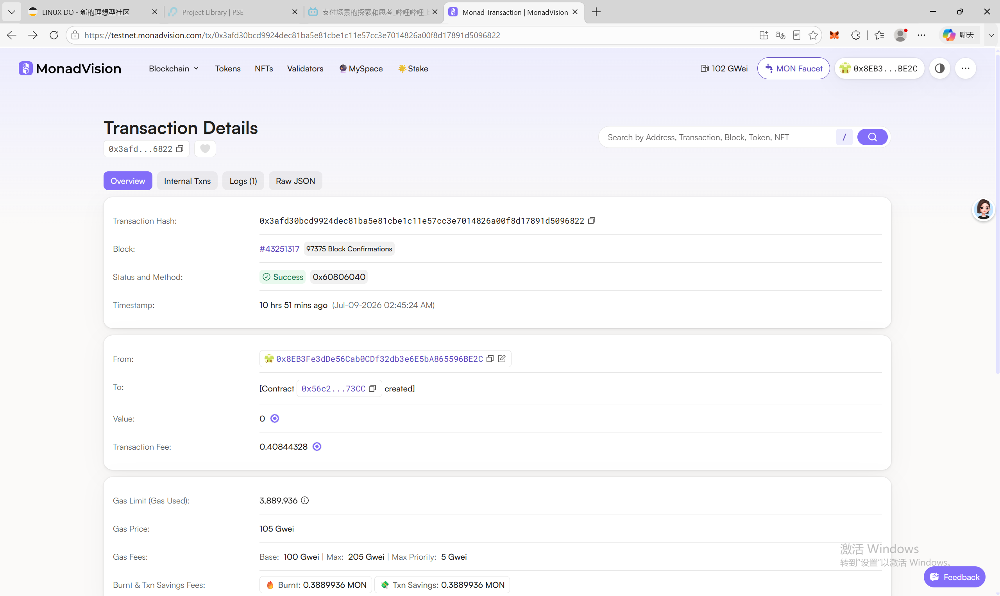
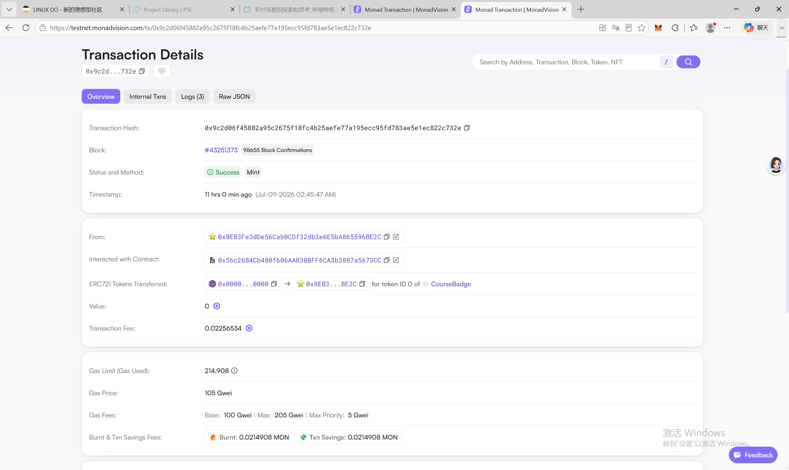
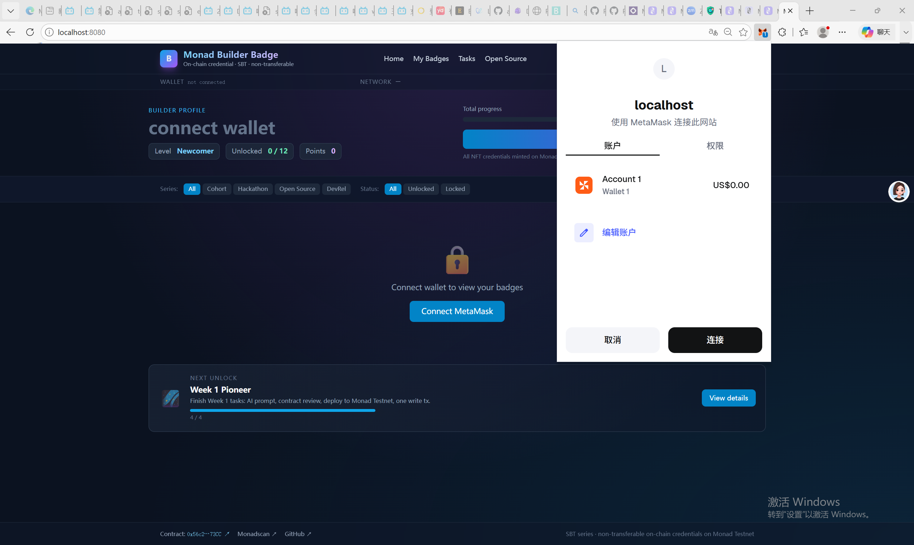
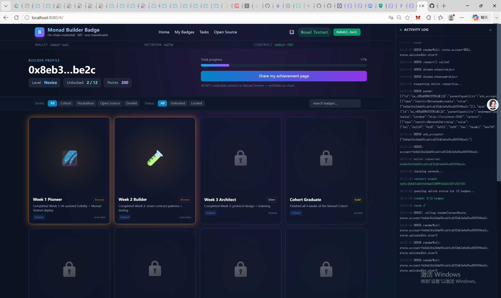
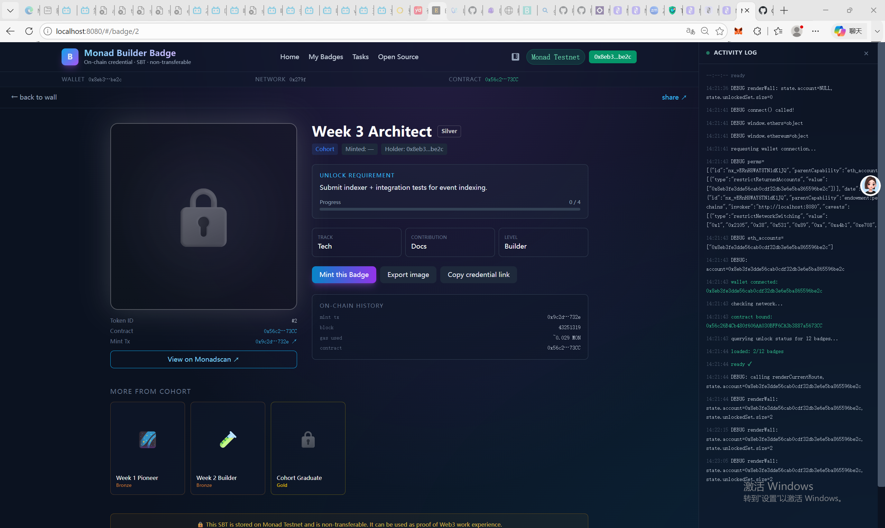
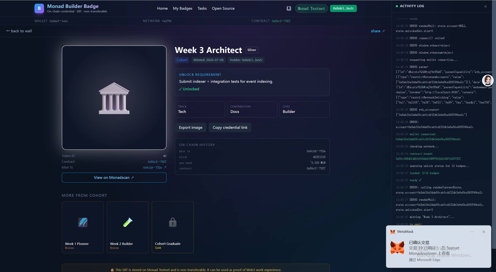

# Week 1 — 部署 NFT Badge 合约到 Monad Testnet

**轨道：** general  
**对应任务：** Day 5 — Mini Demo 0 / 合约部署与交互  
**日期：** 2026-07-09  
**目标：** 走通完整链路：合约源码 → 编译 → 部署 → 合约地址 → read/write 调用 → 区块浏览器验证

**前置任务：** [`ai-solidity-contract-review.md`](./ai-solidity-contract-review.md)（合约源码由 AI 辅助生成并人工审查）


---

## 0. 任务说明

本任务的重点是理解完整链路：合约源码 → 编译 → 部署 → 合约地址 → read / write 调用 → 区块浏览器验证。

提交内容（按任务要求）：
1. 合约地址
2. 部署交易 hash
3. 至少一次合约交互 transaction hash
4. 合约部署或交互截图
5. README v0.1 链接或截图

> ⚠️ 不提交私钥、助记词、API Key、`.env` 文件或真实资产相关敏感信息。

---

## 1. Monad Testnet 网络参数

来源：[Monad Docs — Testnets](https://docs.monad.xyz/developer-essentials/testnets)

| 参数 | 值 |
|------|-----|
| RPC URL | `https://testnet-rpc.monad.xyz/` |
| Chain ID | `10143` (0x279f) |
| 货币符号 | `MONAD` |
| 区块浏览器 | `https://testnet.monadexplorer.com/` |

---

## 2. 部署配置

为了让合约能部署到 Monad 测试网，做了以下修改（合约本身无需改动，因为 Monad 是 EVM 兼容链）。

### 2.1 修改清单

| 文件 | 修改 | 作用 |
|------|------|------|
| [`foundry.toml`](../../../practice/week-1/nft-badge/foundry.toml) | 新增 `[etherscan]` 段，配置 `monadtestnet` 的 explorer URL 和 API key 占位 | 让 `forge script --verify` 能在 Monad Explorer 上验证合约 |
| [`.env.example`](../../../practice/week-1/nft-badge/.env.example) | 新建环境变量模板（**不含真实密钥**） | 标准化部署所需变量；复制为 `.env` 后填入真实值 |
| [`script/Deploy.s.sol`](../../../practice/week-1/nft-badge/script/Deploy.s.sol) | 新建部署脚本，`new NFTBadge("CourseBadge","CB")` | 一键部署 + console 输出合约地址 |
| [`frontend/app.js`](../../../practice/week-1/nft-badge/frontend/app.js) | 加入 `MONAD_TESTNET` 常量 + `ensureMonadTestnet()` | 连接时自动检测/切换到 Monad Testnet；未切到测试网时给出明确提示 |

### 2.2 环境变量

`.env.example` 定义了 3 个变量：

| 变量名 | 用途 | 是否必填 |
|--------|------|---------|
| `MONAD_RPC_URL` | Monad 测试网 RPC 端点 | ✅ 必填 |
| `PRIVATE_KEY` | 部署钱包私钥（**仅课程测试钱包**，前缀 `0x`） | ✅ 必填 |
| `MONAD_EXPLORER_API_KEY` | 区块 explorer 的 API key，用于合约验证 | ⚪ 可选（留空则跳过 `--verify`） |

> ⚠️ **安全约定：**
> - `.env` 已被根目录 `.gitignore` 忽略，**绝不提交**
> - 只使用课程专用测试钱包（与主力钱包分离）
> - 助记词/私钥不写入任何文档、截图、终端历史
> - 测试网 MONAD 没有实际价值，但仍按上述规范操作以养成习惯

### 2.3 部署步骤

```bash
cd practice/week-1/nft-badge

# 1. 复制环境变量模板并填入真实值
cp .env.example .env
#   编辑 .env，填入 PRIVATE_KEY 和 MONAD_RPC_URL

# 2. 加载环境变量
set -a; source .env; set +a

# 3. 先跑一次模拟（不广播），确认脚本与 RPC 通畅
forge script script/Deploy.s.sol:Deploy \
  --rpc-url $MONAD_RPC_URL

# 4. 真正部署 + 验证
forge script script/Deploy.s.sol:Deploy \
  --rpc-url $MONAD_RPC_URL \
  --broadcast \
  --verify \
  --etherscan-api-key $MONAD_EXPLORER_API_KEY \
  -vvv
```

输出会包含 `NFTBadge deployed at: 0x...`，把该地址填入前端的 "Contract address" 输入框即可使用。

### 2.4 部署链路已验证（dry-run）

部署前实际跑过模拟部署（不带 `--broadcast`），结果证明部署链路通畅：

```
$ forge script script/Deploy.s.sol:Deploy --rpc-url https://testnet-rpc.monad.xyz/

## Setting up 1 EVM.
==========================
Chain 10143
Estimated gas price: 205 gwei
Estimated total gas used for script: 3889936
Estimated amount required: 0.79743688 MON
==========================
SIMULATION COMPLETE. To broadcast these transactions, add --broadcast ...
```

- ✅ RPC 连通，Chain ID = 10143 匹配 Monad Testnet
- ✅ 部署脚本可读环境变量并构造交易
- ✅ 估算 gas ~0.8 MON，测试网余额充足即可部署

---

## 3. 部署结果

> 以下为真实执行 `--broadcast` 后填写。

### 3.1 合约地址

```
0x56c26B4Cb480f606AA030BFF6CA3b3887a5673CC
```

**Explorer 链接：** [https://testnet.monadexplorer.com/address/0x56c26B4Cb480f606AA030BFF6CA3b3887a5673CC](https://testnet.monadexplorer.com/address/0x56c26B4Cb480f606AA030BFF6CA3b3887a5673CC)

### 3.2 部署交易 hash

```
0x3afd30bcd9924dec81ba5e81cbe1c11e57cc3e7014826a00f8d17891d5096822
```

**Explorer 链接：** [https://testnet.monadexplorer.com/tx/0x3afd30bcd9924dec81ba5e81cbe1c11e57cc3e7014826a00f8d17891d5096822](https://testnet.monadexplorer.com/tx/0x3afd30bcd9924dec81ba5e81cbe1c11e57cc3e7014826a00f8d17891d5096822)

### 3.3 部署截图


。

### 3.4 部署关键字段

| 字段 | 值 | 含义 |
|------|-----|------|
| 合约地址 | `0x56c26B4Cb480f606AA030BFF6CA3b3887a5673CC` | 部署后合约在链上的地址 |
| 部署 tx hash | `0x3afd30bcd9924dec81ba5e81cbe1c11e57cc3e7014826a00f8d17891d5096822` | 创建合约这笔交易的 hash |
| 部署者（owner）| `0x8EB3Fe3dDe56Cab0CDf32db3e6E5bA865596BE2C` | 课程钱包地址（即合约 owner） |
| 部署区块 | `43251317` | tx 被打包的区块号 |
| gas used | `3889936` gas / ~0.408 MON | 部署消耗的 gas 费（gas price 105 gwei） |
| 状态 | `1 (success)` | 交易执行成功 |

---

## 4. 合约交互

### 4.1 Read function 调用（至少 1 次）

可调用的 read 函数（均为 view，不上链、不花 gas）：
- `name()` / `symbol()` / `owner()` / `nextBadgeTypeId()` / `nextTokenId()`
- `minters(address)` / `badgeTypes(uint256)` / `hasBadge(address, uint256)`

**本次调用记录（当前链上状态）：**

| 函数 | 参数 | 返回值 | 调用方式 |
|------|------|--------|----------|
| `name()` | — | `CourseBadge` | `cast call` |
| `symbol()` | — | `CB` | `cast call` |
| `owner()` | — | `0x8EB3Fe3dDe56Cab0CDf32db3e6E5bA865596BE2C` | `cast call` |
| `nextBadgeTypeId()` | — | `12`（typeId 0-11 全部创建） | `cast call` |
| `nextTokenId()` | — | `3`（已铸造 2 枚：typeId 0, 1） | `cast call` |
| `hasBadge(owner, 0)` | (owner, 0) | `true` | `cast call` |
| `hasBadge(owner, 1)` | (owner, 1) | `true` | `cast call` |

```bash
# 示例：用 cast 调用 read function
cast call <CONTRACT_ADDR> "name()(string)" --rpc-url $MONAD_RPC_URL
cast call <CONTRACT_ADDR> "owner()(address)" --rpc-url $MONAD_RPC_URL
cast call <CONTRACT_ADDR> "hasBadge(address,uint256)(bool)" <addr> 0 --rpc-url $MONAD_RPC_URL
```

### 4.2 Write function 调用（至少 1 次）

可调用的 write 函数（会上链、花 gas）：
- `createBadgeType(string name, string description, string uri)` — 仅 owner
- `setMinter(address account, bool isMinter)` — 仅 owner
- `mint(address to, uint256 typeId)` — 仅 owner 或授权 minter

**本次调用记录（建议流程：先建类型 → 再 mint）：**

| 步骤 | 函数 | 参数 | tx hash | gas used | 说明 |
|------|------|------|---------|----------|------|
| 1 | `createBadgeType` | ("Week1", "finish week1", "ipfs://QmWeek1Badge") | `0xac5efd7d7b3f6b4162240e04972c8a9ac684267d9c6b1aa0bd1fb6f6932b4cc5` | 182,367 | 创建 typeId=0 |
| 2 | `mint` | (owner, 0) | `0x9c2d06f45882a95c2675f18fc4b25aefe77a195ecc95fd783ae5e1ec822c732e` | 214,908 | owner 铸造 typeId=0 |
| 3 | `createBadgeType` | ("Week1Demo", "finished week1 tasks", "ipfs://QmWeek1DemoBadge") | `0x3ce77201adbc8d482534c0ad83e8100662d82e0633ece659e83e6dc27a56ba09` | 193,853 | 创建 typeId=1 |
| 4 | `mint` | (owner, 1) | *(待执行)* | — | owner 铸造 typeId=1 |
| 5 | `createBadgeType` ×10 | typeId 2-11 批量创建 | *(见 §4.4)* | ~165k/笔 | 一次性创建剩余 10 种类型 |

> **注意：** 批量创建 typeId 2-11 使用 `create-all-badges.sh` 脚本，10 笔交易均在 block 433585xx 区间内成功执行。

**批量创建 typeId 2-11 的 tx hash：**

| typeId | 名称 | tx hash |
|--------|------|---------|
| 2 | Week 2 Builder | `0x3ce77201adbc8d482534c0ad83e8100662d82e0633ece659e83e6dc27a56ba09` |
| 3 | Cohort Graduate | *(block 43358529)* |
| 4 | Hackathon Participant | *(block 43358530)* |
| 5 | Hackathon Finalist | *(block 43358531)* |
| 6 | Hackathon Winner | *(block 43358532)* |
| 7 | First PR | *(block 43358533)* |
| 8 | Doc Contributor | *(block 43358534)* |
| 9 | Core Contributor | *(block 43358535)* |
| 10 | Workshop Speaker | `0x6f9d56ef2ed97c73bcf0020c618da65abbe1b6ac2e083a25b1dc739dda2de03b` |
| 11 | Evangelist | `0x421c49a8b9e5b77369273b6343fec57a6db6acc3d4854be2d8fdbe245a832cfd` |

```bash
# 示例：用 cast 发送 write function
cast send <CONTRACT_ADDR> "createBadgeType(string,string,string)(uint256)" \
  "Week1" "finish week1" "ipfs://Qm..." \
  --rpc-url $MONAD_RPC_URL --private-key $PRIVATE_KEY

cast send <CONTRACT_ADDR> "mint(address,uint256)(uint256)" \
  <你的地址> 0 \
  --rpc-url $MONAD_RPC_URL --private-key $PRIVATE_KEY
```

**至少一次合约交互 transaction hash：**

```
createBadgeType (typeId=0): 0xac5efd7d7b3f6b4162240e04972c8a9ac684267d9c6b1aa0bd1fb6f6932b4cc5
mint (typeId=0):            0x9c2d06f45882a95c2675f18fc4b25aefe77a195ecc95fd783ae5e1ec822c732e
createBadgeType (typeId=1): 0x3ce77201adbc8d482534c0ad83e8100662d82e0633ece659e83e6dc27a56ba09
createBadgeType (typeId=10): 0x6f9d56ef2ed97c73bcf0020c618da65abbe1b6ac2e083a25b1dc739dda2de03b
createBadgeType (typeId=11): 0x421c49a8b9e5b77369273b6343fec57a6db6acc3d4854be2d8fdbe245a832cfd
```

**Explorer 链接：**
- Deploy: [https://testnet.monadexplorer.com/tx/0x3afd30bcd9924dec81ba5e81cbe1c11e57cc3e7014826a00f8d17891d5096822](https://testnet.monadexplorer.com/tx/0x3afd30bcd9924dec81ba5e81cbe1c11e57cc3e7014826a00f8d17891d5096822)
- createBadgeType(typeId=0): [https://testnet.monadexplorer.com/tx/0xac5efd7d7b3f6b4162240e04972c8a9ac684267d9c6b1aa0bd1fb6f6932b4cc5](https://testnet.monadexplorer.com/tx/0xac5efd7d7b3f6b4162240e04972c8a9ac684267d9c6b1aa0bd1fb6f6932b4cc5)
- mint(typeId=0): [https://testnet.monadexplorer.com/tx/0x9c2d06f45882a95c2675f18fc4b25aefe77a195ecc95fd783ae5e1ec822c732e](https://testnet.monadexplorer.com/tx/0x9c2d06f45882a95c2675f18fc4b25aefe77a195ecc95fd783ae5e1ec822c732e)

### 4.4 批量创建剩余 badge type（typeId 2-11）

初始部署后链上只有 typeId 0 和 1。前端 mock-data 定义了 12 个 badge（typeId 0-11），因此需要批量创建剩余的 10 种类型。

**操作方式：** 使用 `create-all-badges.sh` 脚本，通过 `cast send` 批量调用 `createBadgeType`。

```bash
cd practice/week-1/nft-badge
source .env && bash create-all-badges.sh
```

**结果：** 10 笔交易全部成功（status=1），gas 消耗约 165k-194k/笔，集中在 block 43358528-43358548 区间。

**创建后链上状态：**

| 指标 | 值 |
|------|-----|
| `nextBadgeTypeId()` | 12（typeId 0-11 全部就绪） |
| `nextTokenId()` | 3（已铸造 2 枚） |
| 总 gas 消耗（批量创建） | ~1.7 MON（10 笔 × ~165-194k gas @ ~104 gwei） |

**Explorer 链接：**
- Block 433585xx: [https://testnet.monadexplorer.com/block/43358528](https://testnet.monadexplorer.com/block/43358528) ~ [https://testnet.monadexplorer.com/block/43358548](https://testnet.monadexplorer.com/block/43358548)




---

## 4.3 在真实前端操作

> 本节用浏览器打开前端页面，连接 MetaMask，完成连接 + 浏览 + mint 调用。

### 4.3.1 启动前端

```bash
cd /home/administrator/monad-cohort-zane/practice/week-1/nft-badge/frontend
python3 -m http.server 8080
```

浏览器打开 `http://localhost:8080`。

### 4.3.2 准备 MetaMask

1. 在 MetaMask 添加 Monad Testnet 网络（如未添加）：
   - Network Name: `Monad Testnet`
   - RPC URL: `https://testnet-rpc.monad.xyz/`
   - Chain ID: `10143`
   - Symbol: `MONAD`
   - Explorer: `https://testnet.monadexplorer.com/`
2. 切换到课程钱包 `0x8EB3...96BE2C`

> 前端内置了网络检测 + 自动切换，但建议手动先切好。

### 4.3.3 连接钱包

**操作：**
1. 点击页面右上角 **Connect Wallet** 按钮
2. MetaMask 弹出账户授权窗口（`wallet_requestPermissions`，每次必弹）→ 选择课程钱包 → 确认
3. 前端检测链 ID，如不在 Monad Testnet 会提示切换

**预期结果：**
- 右上角网络标签显示 `Monad Testnet`（绿色）
- Status bar 显示钱包地址（`0x8EB3...96BE2C`）+ 合约状态 `0x56c2...73CC`
- 右侧抽屉日志自动打开，显示连接过程各步骤日志
- 日志项（带地址/txHash 的）可点击跳转 Monadscan

**📷 截图：连接成功状态**

> 截取整个页面，包含 header 地址、status bar、抽屉日志。

### 4.3.4 浏览 Badge Wall

连接后自动加载 12 个 Badge 的 on-chain unlock 状态（通过 `hasBadge` 调用）。

**操作：**
1. 浏览 Badge 网格界面
2. 可用 filter 栏筛选 Series / Status，或搜索名称
3. 解锁的 badge 显示彩色、灰度表示未解锁

**预期结果：**
- Hero 区域显示解锁数量进度
- Grid 中已解锁 badge 高亮

**📷 截图：Badge Wall**


### 4.3.5 查看 Badge 详情 + Mint

**操作：**
1. 点击任一未解锁的 Badge → 进入详情页
2. 查看 unlock requirement / traits / on-chain 信息
3. 点击 **Mint this Badge** 按钮
4. MetaMask 弹出 gas 确认窗口 → 确认交易
5. 日志显示 `tx sent: 0x...` → 点击该日志行跳转 Monadscan 查看交易
6. 交易确认后，状态刷新，badge 变为 unlocked

**预期结果：**
- MetaMask 弹出（`mint(address,uint256)`）
- 日志区记录完整流程（sent → confirmed）
- badge 状态从 locked 变为 unlocked

**📷 截图：Mint 操作**


> 截取 badge detail 页面 + 右侧抽屉日志（显示 tx sent / confirmed）。

### 4.3.6 日志抽屉

- 点击 header 的 📋 图标按钮打开/关闭右侧日志抽屉
- 日志条目带 txHash 的可点击跳转 Monadscan 查看真实交易
- 底部显示 `N entries` 计数
- Clear log 清空记录

### 4.3.7 截图清单

保存到 `tasks/general/week-1/images/`：

| # | 步骤 | 文件名 | 必填 |
|---|------|--------|------|
| 1 | 连接钱包成功 | `frontend-1-connect.png` | ✅ |
| 2 | Badge Wall 主页 | `frontend-2-wall.png` | ✅ |
| 3 | Details 操作 + 日志 | `frontend-3-details.png` | ✅ |
| 4 | Mint 操作 + 日志 | `frontend-4-mint.png` | ✅ |

---

## 5. 完整链路理解

本任务走通的链路：

```
合约源码 (NFTBadge.sol)
    ↓ forge build
编译产物 (ABI + bytecode)
    ↓ forge script --broadcast
部署交易 (tx 上链)
    ↓
合约地址 (0x...)
    ↓
read 调用 (view, 不上链)
    ├─ cast call / 前端 / Explorer
write 调用 (state change, 上链花 gas)
    ├─ cast send / 前端
    ↓
区块浏览器验证
    └─ https://testnet.monadexplorer.com/address/<addr>
       查看：code、read/write contract、events、internal txs
```

**关键理解：**

1. **合约源码 → 编译**：Solidity 源码经 solc 编译为 ABI（接口描述）+ bytecode（EVM 字节码）。ABI 给前端/工具用，bytecode 才是真正部署到链上的东西。
2. **编译 → 部署**：部署本质是发送一笔 `to = null` 的交易，data = bytecode。交易被区块打包后，状态库里多出一个合约账户，地址由部署者地址 + nonce 决定。
3. **合约地址**：部署成功后，合约获得唯一地址。之后所有 read/write 都通过这个地址访问。
4. **read vs write**：read 是 view 函数，**本地节点直接返回**，不上链、不花 gas、不改变状态；write 是 state-changing 函数，**要广播交易、等打包、花 gas**，结果在交易 receipt 里。
5. **区块浏览器验证**：Explorer 上的 "Contract" 标签可看到源码（若 verify 过）、可点对点调用 read/write；"Transactions" 标签可看到每次 write 的交易记录和 event 日志。

---

## 6. 产物索引

| 产物 | 路径 |
|------|------|
| 合约源码 | [`practice/week-1/nft-badge/contracts/NFTBadge.sol`](../../../practice/week-1/nft-badge/contracts/NFTBadge.sol) |
| 部署脚本 | [`practice/week-1/nft-badge/script/Deploy.s.sol`](../../../practice/week-1/nft-badge/script/Deploy.s.sol) |
| 环境变量模板 | [`practice/week-1/nft-badge/.env.example`](../../../practice/week-1/nft-badge/.env.example) |
| 前端 | [`practice/week-1/nft-badge/frontend/`](../../../practice/week-1/nft-badge/frontend/) |
| **README v0.1** | [`practice/week-1/nft-badge/README.md`](../../../practice/week-1/nft-badge/README.md) |
| 前置任务（合约审查） | [`tasks/general/week-1/ai-solidity-contract-review.md`](./ai-solidity-contract-review.md) |

---

## 7. 提交清单

按任务要求的 5 项提交内容，对照如下：

|| # | 要求 | 位置 | 状态 |
||---|------|------|------|
|| 1 | 合约地址 | §3.1 | ✅ `0x56c26B4Cb480f606AA030BFF6CA3b3887a5673CC` |
|| 2 | 部署交易 hash | §3.2 | ✅ `0x3afd30bcd9924dec81ba5e81cbe1c11e57cc3e7014826a00f8d17891d5096822` |
|| 3 | 至少一次合约交互 tx hash | §4.2 | ✅ createBadgeType + mint 多次 |
|| 4 | 合约部署或交互截图 | §3.3 / §4.2 / §4.3 | ✅ 已就绪（6 张截图） |
|| 5 | README v0.1 链接或截图 | §6 | ✅ 已就绪 |

**敏感信息检查：**
- ✅ 不含私钥、助记词
- ✅ 不含 API Key（`MONAD_EXPLORER_API_KEY` 仅作变量名出现）
- ✅ 不含 `.env` 真实内容
- ✅ 截图占位已注明"不得包含私钥"
