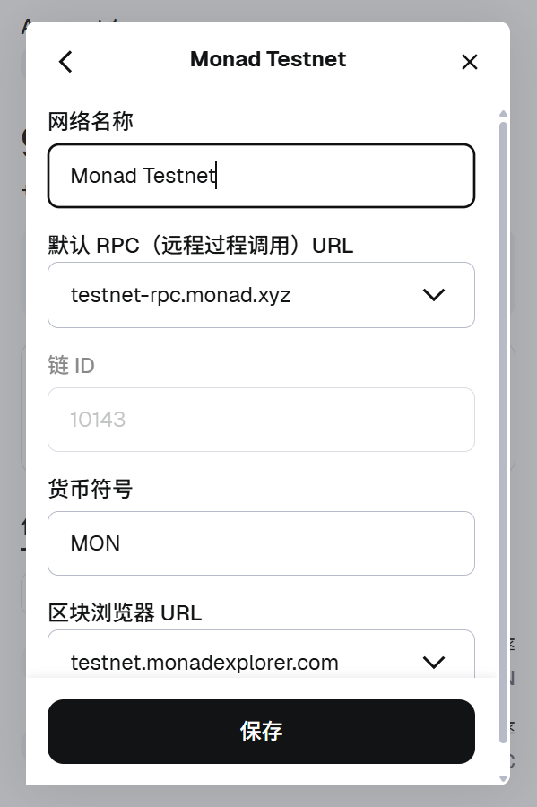
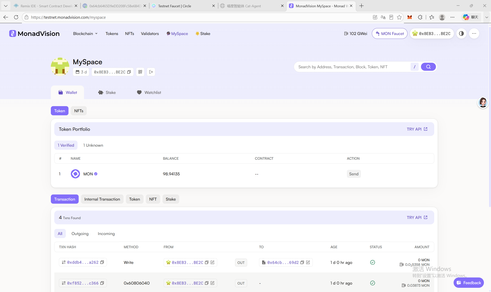

# Week 1 — 钱包准备 & Monad Testnet 配置

## 1. 课程钱包地址

**钱包工具：** MetaMask  
**钱包地址：** `0x8EB3Fe3dDe56Cab0CDf32db3e6E5bA865596BE2C`  
**说明：** 课程专用钱包，与主力钱包分离，仅用于 Monad Testnet 学习和测试。

---

## 2. Monad Testnet 网络配置

| 配置项 | 值 |
|--------|-----|
| 网络名称 | Monad Testnet |
| RPC URL | `https://testnet-rpc.monad.xyz/` |
| Chain ID | `10143` (0x279f) |
| 货币符号 | `MONAD` |
| 区块浏览器 | `https://testnet.monadexplorer.com/` |

**验证：** 通过 RPC 调用 `eth_chainId` 确认返回 `0x279f`，与 Chain ID 10143 一致。


> ⚠️ 截图占位：请在 MetaMask 中切换到 Monad Testnet 网络并截图，替换此占位。

---

## 3. 区块浏览器查询

**Explorer 链接：** [https://testnet.monadexplorer.com/address/0x8EB3Fe3dDe56Cab0CDf32db3e6E5bA865596BE2C](https://testnet.monadexplorer.com/address/0x8EB3Fe3dDe56Cab0CDf32db3e6E5bA865596BE2C)

**通过 RPC 查询到的地址状态：**
- 余额：约 **98.94 MONAD**（测试网）
- 地址类型：EOA（Externally Owned Account）
- 当前 Monad Testnet 区块高度：约 43,200,000+

```bash
# 通过 RPC 查询余额
curl -s "https://testnet-rpc.monad.xyz/" -X POST -H "Content-Type: application/json" \
  -d '{"jsonrpc":"2.0","method":"eth_getBalance","params":["0x8EB3Fe3dDe56Cab0CDf32db3e6E5bA865596BE2C", "latest"],"id":1}'
# 返回：0x55d164d50706e41d8 = 98.94 MONAD
```


> ⚠️ 截图占位：请在浏览器中打开上述链接并截图，替换此占位。

**区块浏览器看到的关键信息：**
- 最新区块高度 — 当前 Testnet 已有超过 4300 万个区块（Monad 出块速度快）
- 地址的交易历史 — 该地址的转入/转出记录
- 余额（MONAD）— 测试网代币余额
- Token 持有情况 — 该地址持有的代币

---

## 4. 链上产品 vs 普通互联网产品

链上产品（DApp / 智能合约）与普通互联网产品的核心区别在于**信任机制**。

普通互联网产品依赖中心化服务器和数据库，用户信任平台方不出错、不作恶——但用户无法验证后台逻辑是否真的按承诺执行。链上产品则将核心逻辑写入智能合约部署在区块链上，所有状态变更永久公开、可查证、不可篡改。用户不需要信任某个公司，只需信任合约代码和共识协议。

换句话说，互联网产品是"我承诺这么做"，链上产品是"代码承诺这么做，且任何人都能验证"。代价是链上产品的用户体验更差、成本更高、修改更困难——每一次状态变更都需要用户支付 Gas 费并等待确认。这是去中心化信任的交换：用效率和流畅度换透明度和自主权。

---

## 安全检查清单

- [x] 课程钱包与主力钱包分离
- [x] 助记词已离线备份，**未在任何数字设备或截图中保存**
- [x] 在 MetaMask 中已将 Monad Testnet 设为可见网络
- [x] 理解测试网 MONAD 没有实际价值，无需保管
