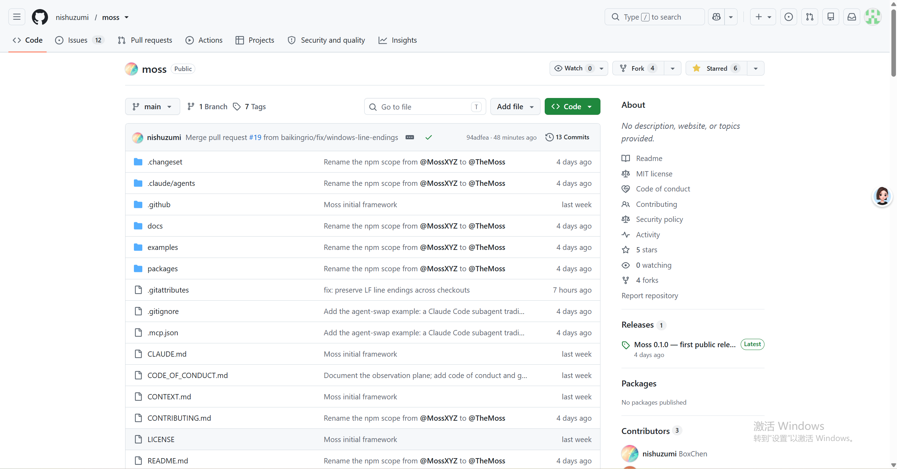

# Moss 学习分享

> ⭐ 已 Star Moss GitHub 仓库，截图如下：
>
> 

## 项目简介

Moss 是一个面向 AI Agent 的 Monad 链 DApp 交互框架，把复杂的协议交互抽象为统一的 `discover → load → action → simulate` 四步流程。

## 核心问题

AI Agent 直接与 DApp 交互时面临两个致命痛点：

1. **Calldata 手搓风险高** — Agent 需要从 ABI 解析合约地址、处理 decimals 换算、组装 multicall/扫尾逻辑，任何一个环节出错就可能导致资金损失。
2. **签名前缺乏验证** — Agent 构建的交易在用户签名前没有机械化的安全校验，意图偏差难以察觉。

## 核心能力

- **能力层抽象**：Agent 使用人类可读参数（如 `"MON"`, `"1.5"`），Moss 负责组装完整的未签名交易 Plan。
- **Effects 对账**：模拟层用 `debug_traceCall` 回放交易到真实链状态，提取实际资产流向，与 Plan 声明的 `expects` 逐项比对，任何差异产生 warning。
- **Halt Rule**：只要有 warning，Agent 必须停止，不得将交易交给用户签名。
- **意图对齐**：零 warning 不代表交易正确 — Agent 还需将 effects 摘要与用户的原始意图对比。
- **永不签名、永不发送**：Moss 只构建和验证，私钥留在钱包，最终决定权在用户。

## 可能应用场景

| 场景 | 说明 |
|------|------|
| AI Agent 驱动的 DeFi 助手 | 用户说"把我的 MON 换成 USDC"，Agent 走完 discover→simulate→用户确认→签名 |
| 多步骤复杂 DeFi 流程 | claim → swap → supply 串联，simulate 跨 Plan 延续状态确保每一步正确 |
| 协议适配器标准化 | 新协议只需写一个 package，声明 ABIs + capabilities + observations |
| Agent 安全沙箱 | 本地 anvil fork 上跑真实订单簿状态，零资金零配置验证流程 |

## 我的理解

Moss 的本质是**把 DApp 交互的复杂性从 Agent 侧转移到协议适配层**。Agent 不再需要理解每个协议的 ABI、合约地址、decimals 换算，它只需要说出用户的意图（"swap 1 MON for USDC"），Moss 负责找到对应能力、构建交易 Plan、模拟验证、报告效果。

这对 AI Agent 生态的意义在于：目前 Agent 与链交互的风险主要来自"几乎正确"的交易 — 差一个 decimal、多一个 multicall 步骤就可能丢钱。Moss 通过机械化的 simulate + halt rule 消除了这类风险。

未来 Moss 如果扩展到更多协议（借贷、NFT、跨链），它可能成为 AI Agent 与区块链交互的标准中间件层，类似 Web2 中的 SDK/API Gateway。

## Issue 分析

截至 2026-07-13，Moss 仓库共有 **12 个 open issues**，按类别分布：

| 类别 | 数量 | 说明 |
|------|------|------|
| `adapter` | 8 | 协议适配器开发请求（DeFi 协议接入） |
| `difficulty:intermediate` | 5 | 中等难度任务 |
| `dex` | 4 | 去中心化交易所相关 |
| `difficulty:advanced` | 3 | 高难度任务 |
| `lending` | 3 | 借贷协议接入 |
| `interface-layer` | 2 | 接口层扩展 |
| `good first issue` | 2 | 适合新贡献者 |

### 关键 Issue 解读

**协议扩展方向（核心路线图）：**
- #15 `Design: perpetuals need verbs and a category` — 永续合约需要新的 verb 分类，说明 Moss 正在从 DEX 向衍生品扩展
- #14 `Interface layer: ERC-1155 multi-token` — 多代币标准支持，扩大 NFT 覆盖范围
- #13 `Interface layer: ERC-4626 tokenized vaults` — 标准化金库接口，覆盖 yield farming 场景

**DeFi 协议接入（8 个 adapter 请求）：**
- DEX: PancakeSwap (#6), Uniswap v4 (#5), Clober (#7)
- Lending: Aave v3 (#8), Morpho (#9), Euler v2 (#10)
- Yield: Pendle (#11), FastLane shMONAD staking (#12)

这说明 Moss 的协议接入是**社区驱动**的，用户提 issue 请求接入，贡献者按难度分级实现。

**项目活跃度判断：**
- PR #19 `fix: preserve LF line endings` 刚合并（2026-07-14），说明维护活跃
- 大部分 adapter issue 仍处于 open 状态，表明**协议生态扩展空间很大**
- `good first issue` 标签的存在说明作者鼓励社区贡献

### 对我理解 Moss 的启示

1. **Moss 的定位不仅是 Monad 工具** — 它通过 `adapter` + `interface-layer` 两层设计，目标是成为多链 AI Agent 的 DApp 交互标准
2. **协议生态 = 护城河** — 接入的协议越多，Agent 可执行的操作越丰富，网络效应明显
3. **难度分级暗示了成长路径** — starter → intermediate → advanced 对应贡献者技能提升路线

- [Moss GitHub](https://github.com/nishuzumi/moss)
- [Getting Started Guide](https://github.com/nishuzumi/moss/blob/main/docs/getting-started.md)
- [Agent Skill Guide](https://github.com/nishuzumi/moss/blob/main/docs/agent-skill.md)
- [Moss README (中文)](https://github.com/nishuzumi/moss/blob/main/README.zh-CN.md)
